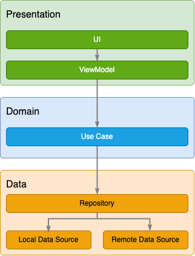

# Mobile Engineer Practical Test

**Author:** Daniel Estrada  
**Status:** [Draft]  
**Last updated:** 2025-06-22

## Overview

This solution is intended to represent a real-world example of software development in an enterprise-like environment implementing a feature by using a layered architecture, dependency injection and a test strategy.

## Requirements

The present solution meets the following criteria:

- [x] Robust layered architecture.
- [x] Fetch list of items from [endpoint](https://jsonblob.com/api/1151549092634943488).
- [x] Cache the network response in a local database.
- [x] Display data correctly to the UI.
- [x] Dependency Injection.
- [x] Unit testing.

## Architecture

The architecture approach for this solution addresses the considerations described in Google's [Guide to app architecture](https://developer.android.com/topic/architecture). 
With these considerations in mind, the goal for this solution is to provide a robust architecture that achieves the following benefits:

- Separation of concerns
- Maintainability
- Scalability
- Testability

So, for this project, the architecture consists of a 3-layered architecture where each layer is a ***package*** and the layers are ***presentation, data*** and ***domain.***

**Figure 1.** *Application architecture overview.*

### Presentation Layer

This is the UI-related layer. It is responsible for displaying data, handling user interactions and managing UI logic (e.g., displaying error messages or a loader during network operations).

**Implementation details:** 

- [Jetpack Compose](https://developer.android.com/compose): Reduces boilerplate code, increases readability and reduces development times.
- MVVM Architecture: Reactive pattern and lifecycle-aware using ViewModel.
- [Coil](https://coil-kt.github.io/coil/): Third-party library for displaying images from the internet.

### Domain Layer

It contains abstractions of the application's business logic and core entities. Pure Kotlin code independent of the Android Framework. Makes testability and reusability easier.

**Implementation details:** 

- **Model:** Represents the core data structure, independent of how data is fetched or displayed.

- **Use Cases:** These classes encapsulate specific business rules. 

### Data Layer

Provides a single source of truth for the application data. Coordinates how data is fetched and stored using the *Repository* pattern.

**Implementation details:** 

- [Retrofit](https://square.github.io/retrofit/): Library used for making networking operations.

- [Room](https://developer.android.com/training/data-storage/room): Provides an abstraction layer to conveniently work on local SQLite database.

## Dependency Injection

This solution uses [Hilt](https://developer.android.com/training/dependency-injection/hilt-android) as the dependency injection library which is recommended by Google and provides built-in support for the Android and Jetpack SDK.

## Trade-offs

### Boilerplate code

As mentioned in the overview, this solution aims to represent a real-world example of an Android application which, for such a basic application, adds unnecessary layers of abstraction and complexity that can easily be omitted to improve simplicity. 

### Declarative UI using Jetpack Compose

While Jetpack Compose is a powerful tool to build UIs, it can easily become a large codebase that can lead to performance issues, code that is hard to maintain and unpredictable behavior.

### Dependencies

By including a relatively small set of dependencies and Gradle plugins in a small project, it considerably increases compilation times and App bundle size.
